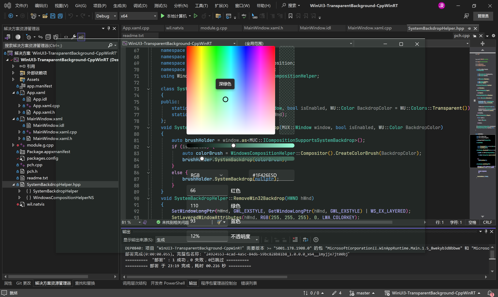

# WinUI3透明背景 WinUI3 Transparent Background Cpp/WinRT Implementation 

[cnbluefire/WinUI3TransparentBackground](https://github.com/cnbluefire/WinUI3TransparentBackground)的C++实现

## Original Readme

WinUI3的窗口背景有两层，一层是Win32窗口的背景，一层是DesktopWindowXamlSource中Visual的背景。

去除Win32窗口背景的方式有很多，这里参考了[castorix/WinUI3_Transparent](https://github.com/castorix/WinUI3_Transparent)的方案

去除Visual背景的方式，是通过ICompositionSupportsSystemBackdrop接口设置一个透明画刷，此时框架会自动移除黑底。

## 示例 Demo

## 已知问题 Known Issues

1. 顶部背景去除不全
